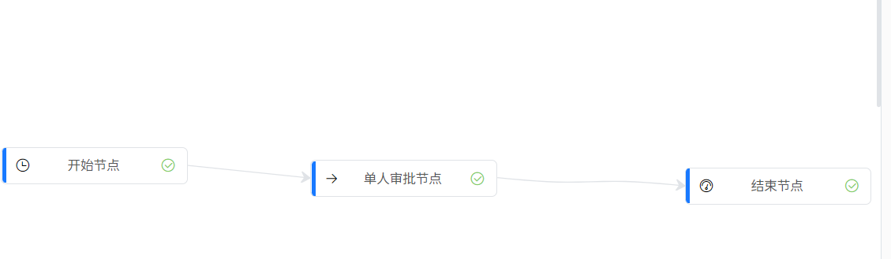
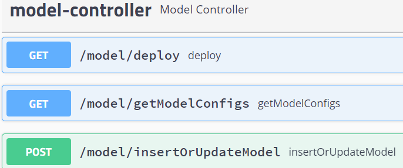
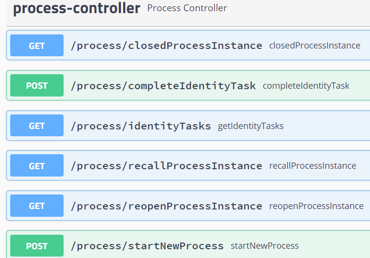

# simpleworkflow
极简工作流 支持 排他网关/并行网关/多人会签 等功能，该项目由两个模块组成:
+ 前端流程设计器: simpleWorkflow_frontend
+ 后端工作流引擎: simpleWorkflow_backend


## 前端流程设计器: simpleWorkflow_frontend

前端流程设计器fork 于 [BiaoChengLiu/easy-flow: 基于VUE+JsPlumb的流程设计器 (github.com)](https://github.com/BiaoChengLiu/easy-flow) 并针对次项目做了定制化修改,包括但不限于:

- 流程数据新增/持久化
- 流程数据部署到工作流引擎
- 增加网关节点
- 增加line中的优先级配置
- 细分工作流中的各类节点/开始/结束/单人审批/多人会签/任务节点

 

构建流程:

1. git clone git@github.com:ZAKLLL/simpleworkflow.git
2. cd simpleWorkflow_frontend
3. npm install
4. npm run dev


## 后端工作流引擎: simpleWorkflow_backend

simpleWorkflow为一个由kotlin+SpringBoot+mybatis-Plus 编写的轻量级工作流引擎，支持，单人审批/多人会签/排他网关/并行网关等功能实现

+ 流程定义格式:

  + 区别于flowable/activity 中的bpmn.xml 格式,simpleWorkFlow使用json来定义流程,示例如下:

    + 

      ```json
      {
          "modelId": "4d7d44e224e9ee786797b1ff66796cc9",
          "name": "ADF",
          "nodes": [
              {
                  "id": "2kyuy7vazf",
                  "name": "开始节点",
                  "type": "START_NODE",
                  "top": "256px",
                  "left": "7px",
                  "ico": "el-icon-time",
                  "pid": null,
                  "sid": "9m2wpp80k"
              },
              {
                  "id": "bkgqg4til9",
                  "name": "结束节点",
                  "type": "END_NODE",
                  "top": "275px",
                  "left": "637px",
                  "ico": "el-icon-odometer",
                  "pid": "cl96lhg1mz",
                  "sid": null
              },
              {
                  "id": "pken1yub7d",
                  "name": "单人审批节点",
                  "type": "SINGLE_USER_TASK_NODE",
                  "top": "268px",
                  "left": "292px",
                  "ico": "el-icon-right",
                  "pid": "9m2wpp80k",
                  "sid": "cl96lhg1mz"
              }
          ],
          "lines": [
              {
                  "id": "9m2wpp80k",
                  "pid": "2kyuy7vazf",
                  "sid": "pken1yub7d"
              },
              {
                  "id": "cl96lhg1mz",
                  "name": "",
                  "pid": "pken1yub7d",
                  "sid": "bkgqg4til9",
                  "exclusiveOrder": "1",
                  "flowConditionExpression": ""
              }
          ],
          "gateways": [],
      }
      ```

    + 流程中的元素信息被分为 node/line/gateway 分别是，节点/路线/网关 ，其中

      + 节点:
        + 开始节点: 每个流程都应该具有开始节点，并且流程从此节点开始进行
        + 结束节点: 买个流程都应该具有结束节点,此节点在流程中可以为多个,但是每个除结束节点之外的节点均具有到达结束节点的通路.
        + 单人审批节点: 每个节点只会产生一个identitytask分配给一个identity,进行审批。
        + 多人会签节点: 每个节点只会产生多个identitytask分配给多个identity,进行审批。
        + 任务节点: 无需审批，该节点自行触发审批功能，完成后自动流转到下个阶段(开发中...)
      + line:
        + 节点出发: 无任何条件，节点完成后自动通过次line流转到下个元素
        + 排他网关出发: 需要指定flowConditionExpression(条件表达式) 及 exclusiveOrder(排他顺序),优先按照排他顺序，选择指定line,校验 flowConditionExpression 是否满足，如匹配成功，通过当前line 进入下个审批元素
        + 并行网关出发: 无需指定 flowConditionExpression(条件表达式) 及 exclusiveOrder(排他顺序) ,流程自动根据并行网关的出度，生成多个通路的task
      + 网关:
        + 排他网关:  经过此网关的 流程只会产生一个实际通路
        + 并行网关:  经过此网关的 流程只会产生多条实际通路,通路数等于网关出度

  + 系统启动:

    + git clone git@github.com:ZAKLLL/simpleworkflow.git
    + cd simpleWorkflow_backend
    + mvn clean install
    + 创建项目对应数据库 xxxWorkFlow
    + 初始化项目sql: 后端目录下的 workflow.sql
      + t_model_config: 流程模型配置，包含了流程的 前端模型定义，是否部署等字段
      + t_model_component: 流程组件，为每个流程具体元素的后端模型定义
      + t_process_instance: 流程实例表
      + t_node_task:节点任务表
      + t_identity_task: identity任务表

  + 系统核心api:

    + model-controller(流程模型配置相关，包括新增，更新，部署，模型检测等)

      

    + process-controller(流程审批相关，包括启动,关闭,撤回,审批,查询identity相关任务等)

      


## 流程启动/审批示例:

1. 插入模型: /model/inserOrupdateModel()
2. 部署模型: /model/deploy()
3. 启动流程:/process/startNewProcess() 
4. 通过步骤3中的identityId查询对应的identitytask:/process/getIdentityTasks
5. 执行审批动作:/pocess/completedIdentityTask