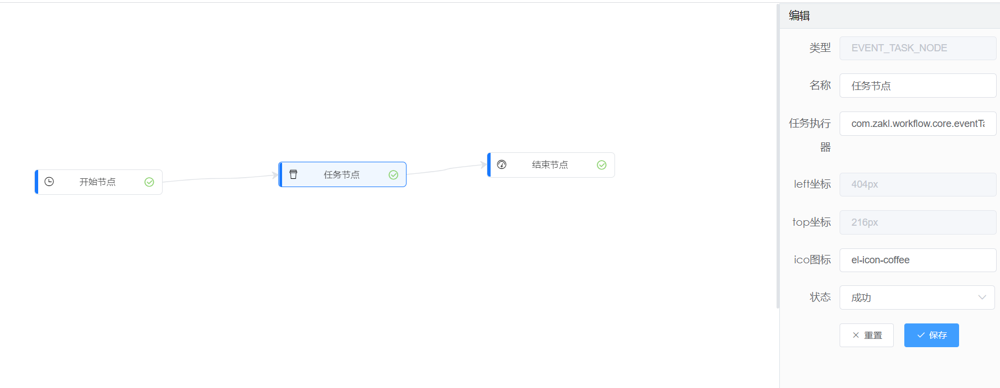
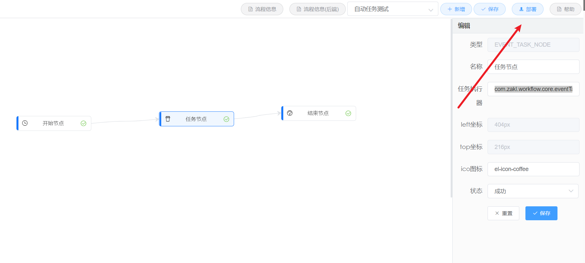
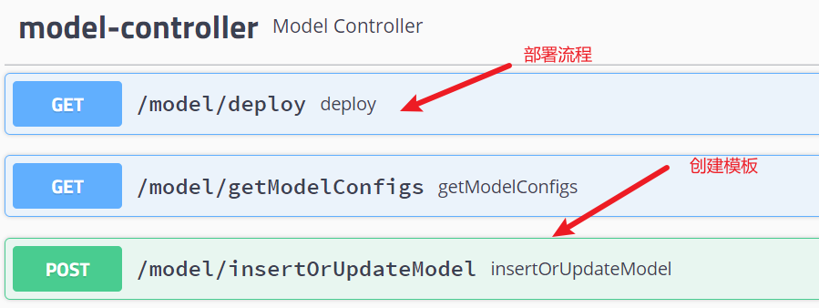
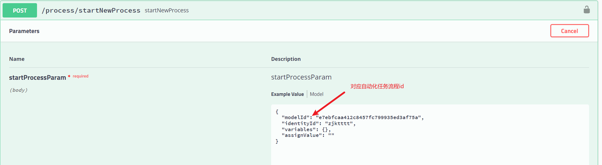
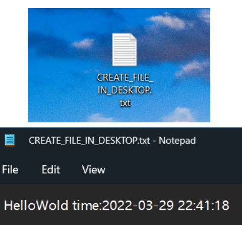
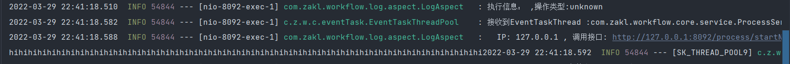
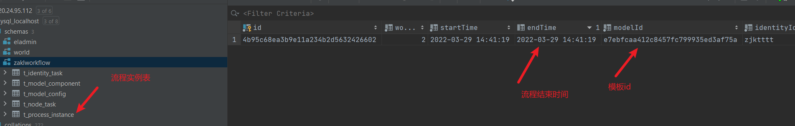

## 自动任务节点

此示例为演示如何创建自己的自动任务节点，并自动触发任务，当任务完成后进行自动审批提交到下一个节点

+ 流程图如下:

  

+ 流程节点信息如下:

  ```json
  {
      "modelId": "e7ebfcaa412c8457fc799935ed3af75a",
      "name": "自动任务测试",
      "nodes": [
          {
              "id": "rmk1cj6re",
              "name": "开始节点",
              "type": "START_NODE",
              "top": "226px",
              "left": "77px",
              "ico": "el-icon-time",
              "sid": "9trv68nqt9"
          },
          {
              "id": "lk6mu9s5g",
              "name": "任务节点",
              "type": "EVENT_TASK_NODE",
              "top": "216px",
              "left": "404px",
              "ico": "el-icon-coffee",
              "eventTaskExecutor": "com.zakl.workflow.core.eventTask.CREATE_FILE_IN_DESKTOP",
              "pids": [
                  "9trv68nqt9"
              ],
              "sid": "ch0x8hxgkb"
          },
          {
              "id": "htjv1lo868",
              "name": "结束节点",
              "type": "END_NODE",
              "top": "203px",
              "left": "683px",
              "ico": "el-icon-odometer",
              "pids": [
                  "ch0x8hxgkb"
              ],
              "sid": null
          }
      ],
      "lines": [
          {
              "id": "9trv68nqt9",
              "pid": "rmk1cj6re",
              "sid": "lk6mu9s5g"
          },
          {
              "id": "ch0x8hxgkb",
              "pid": "lk6mu9s5g",
              "sid": "htjv1lo868"
          }
      ],
      "gateways": [],
      "sourModelInfo": "{\"name\":\"自动任务测试\",\"nodeList\":[{\"id\":\"rmk1cj6re\",\"name\":\"开始节点\",\"type\":\"START_NODE\",\"left\":\"77px\",\"top\":\"226px\",\"ico\":\"el-icon-time\",\"state\":\"success\",\"gateway\":false},{\"id\":\"lk6mu9s5g\",\"name\":\"任务节点\",\"type\":\"EVENT_TASK_NODE\",\"left\":\"404px\",\"top\":\"216px\",\"ico\":\"el-icon-coffee\",\"state\":\"success\",\"gateway\":false,\"eventTaskExecutor\":\"com.zakl.workflow.core.eventTask.CREATE_FILE_IN_DESKTOP\"},{\"id\":\"htjv1lo868\",\"name\":\"结束节点\",\"type\":\"END_NODE\",\"left\":\"683px\",\"top\":\"203px\",\"ico\":\"el-icon-odometer\",\"state\":\"success\",\"gateway\":false}],\"lineList\":[{\"from\":\"rmk1cj6re\",\"to\":\"lk6mu9s5g\",\"id\":\"9trv68nqt9\"},{\"from\":\"lk6mu9s5g\",\"to\":\"htjv1lo868\",\"id\":\"ch0x8hxgkb\"}],\"modelId\":\"e7ebfcaa412c8457fc799935ed3af75a\"}"
  }
  ```


## 演示步骤

+ **创建任务执行器**:

  + 在此示例中，我们创建的执行器名称为：**com.zakl.workflow.core.eventTask.CREATE_FILE_IN_DESKTOP** ，该执行器为一个java/kotlin 的类，且需要继承***com.zakl.workflow.core.eventTask.EventTaskExecute*** 并对其中的 ***execute*** 函数进行实现(如下):

    ```java
    package com.zakl.workflow.core.eventTask
        
    class EventTaskExecuteResult(
        var identityTaskId: String,
        var variables: Map<String, *>,
        var assignValue: String?
    )
    
    
    @FunctionalInterface
    interface EventTaskExecute {
        /**
         * 任务节点执行器需要实现的函数,此函数为具体任务节点的业务逻辑实现
         */
        fun execute(identityTaskId: String, variables: Map<String, *>): EventTaskExecuteResult
    }
    
    /**
     * 执行器示例
     */
    class CREATE_FILE_IN_DESKTOP : EventTaskExecute {
        override fun execute(identityTaskId: String, variables: Map<String, *>): EventTaskExecuteResult {
    
            val file = File("C:\\Users\\Zakl\\Desktop\\CREATE_FILE_IN_DESKTOP.txt")
            if (!file.exists()) {
                file.createNewFile()
            }
            val bufferedWriter = BufferedWriter(FileWriter(file, true))
            bufferedWriter.write("HelloWold time:" + DateUtil.format(Date(), "yyyy-MM-dd HH:mm:ss"))
            bufferedWriter.write("\n")
            bufferedWriter.flush()
            bufferedWriter.close()
            for (i in 0 until 10) {
                print("hihihihihi")
            }
            return EventTaskExecuteResult(identityTaskId, variables, null)
        }
    }
    ```


+ **部署流程**:

  + 直接通过前端项目**simpleWorkflow_frontend**进行部署:

    

  + 或者通过swagger，调用接口进行创建流程模板,并部署:

    


+ **启动流程**:

  + 因为流程中只存在 一个有意义的任务节点，无其他流程节点，所以我们仅需执行启动流程即可(**开始节点**流程会自动审批完毕,**结束节点**无需审批)：

    

  + 到这一步实际流程实例已经跑完。


+ **效果展示**:

  + 让我们看看桌面文件是否创建成功，并写入内容:

    

  + 控制台数据输出：

    

  + 流程/实例状态:

    

  + 演示完毕，任务节点任务执行成功,自动审批成功实现